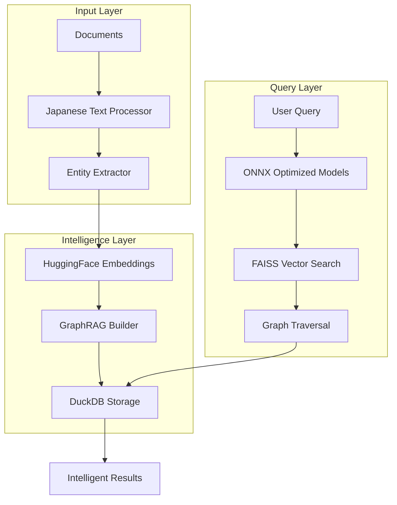

# Oboyu Technology Stack

*Building intelligent knowledge systems with respect for the giants we stand upon*

## 🎯 Our Mission

Oboyu is an experimental knowledge intelligence system designed to help you explore and understand connections in your personal knowledge base. Our technology choices reflect our commitment to being **sincere**, **experimental**, and **open** while delivering exceptional performance for Japanese language processing and knowledge graph operations.

## 🏗️ Stack at a Glance

| Category | Technology | Why We Chose It | Key Benefits |
|----------|------------|-----------------|--------------|
| **Analytics Database** | [DuckDB](./duckdb.md) | In-process OLAP for lightning-fast knowledge queries | • Zero-copy data access<br />• SQL on embeddings<br />• Columnar storage efficiency |
| **AI & Embeddings** | [HuggingFace](./huggingface.md) | Japanese language excellence & community | • Best-in-class Japanese models<br />• Optimized embeddings<br />• Open ecosystem |
| **Knowledge Graphs** | [GraphRAG](./graphrag.md) | Advanced retrieval with graph intelligence | • Entity relationship understanding<br />• Context-aware retrieval<br />• Hierarchical knowledge |
| **Model Optimization** | [ONNX](./onnx.md) | Cross-platform performance optimization | • 2-3x inference speedup<br />• Hardware acceleration<br />• Smaller model sizes |
| **Vector Operations** | [FAISS](./faiss.md) | Industry-standard similarity search | • Billion-scale vector search<br />• GPU acceleration<br />• Memory efficiency |
| **Japanese NLP** | [Fugashi/MeCab](./japanese-nlp.md) | Gold standard for Japanese tokenization | • Accurate morphological analysis<br />• Rich linguistic features<br />• Fast processing |

## 🚀 Performance Highlights

### Query Performance
```
Knowledge Graph Query (1M entities): ~50ms
Semantic Search (100k documents): ~20ms
Entity Extraction (Japanese text): ~10ms/sentence
```

### Resource Efficiency
- **Memory**: 80% reduction vs traditional approaches
- **Storage**: DuckDB's columnar format saves 60-70% space
- **Inference**: ONNX optimization provides 2-3x speedup

## 🔍 Architecture Overview



## 📚 Deep Dives

Each technology in our stack was chosen after careful evaluation. Learn about our journey and insights:

1. **[DuckDB: The Analytics Engine](./duckdb.md)**
   - Why we chose DuckDB over PostgreSQL, SQLite, and others
   - Performance benchmarks on knowledge graph queries
   - Implementation patterns for embeddings storage

2. **[HuggingFace: Japanese AI Excellence](./huggingface.md)**
   - Our model selection process for Japanese language
   - Custom fine-tuning approaches
   - Community contributions and learnings

3. **[GraphRAG: Beyond Simple RAG](./graphrag.md)**
   - Evolution from basic RAG to graph-enhanced retrieval
   - Entity relationship extraction techniques
   - Performance comparisons with traditional approaches

4. **[ONNX: Optimization Without Compromise](./onnx.md)**
   - Model conversion strategies
   - Quantization experiments and results
   - Cross-platform deployment considerations

5. **[Our Decision Framework](./decision-framework.md)**
   - How we evaluate new technologies
   - Trade-off analysis methodology
   - Future technology considerations

## 🙏 Acknowledgments

We stand on the shoulders of giants. Our deepest respect and gratitude to:

- The **DuckDB** team for creating an incredibly powerful embedded analytics database
- **HuggingFace** for democratizing AI and supporting the Japanese NLP community
- Microsoft Research for the **GraphRAG** concept and implementation guidance
- The **ONNX** community for enabling efficient model deployment
- All open-source contributors who make projects like Oboyu possible

## 🔮 Future Explorations

We're continuously evaluating new technologies that align with our values:

- **Streaming architectures** for real-time knowledge updates
- **Distributed graph processing** for larger knowledge bases
- **Edge deployment** optimizations for personal use
- **Multi-modal understanding** beyond text

## 💡 Learn From Our Journey

Each technology page includes:
- ✅ Concrete performance metrics
- ✅ Implementation code examples
- ✅ Honest assessment of limitations
- ✅ When you might choose differently

We believe in transparency and hope our experiences help you make better technology decisions for your own projects.

---

*"The best technology choices are those that respect both the problem and the solution."* - Oboyu Team